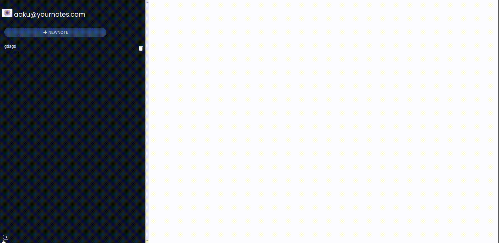

# your-notes
## Note-taking app

## Features:
1. Private notes for signedin members
2. authenticated routes
3. React routing
4. Delete notes that are not required.
5. Forgot password
6. edit existing notes

## Technology used
1. Reactjs-Frontend
2. Firebase-auth and backend
3. Materials-ui-for icons
4. React-quill-editor

[Live Link](https://yournote34.netlify.app/)
